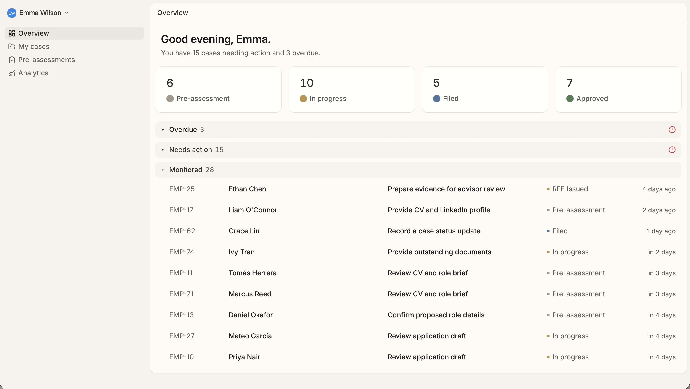
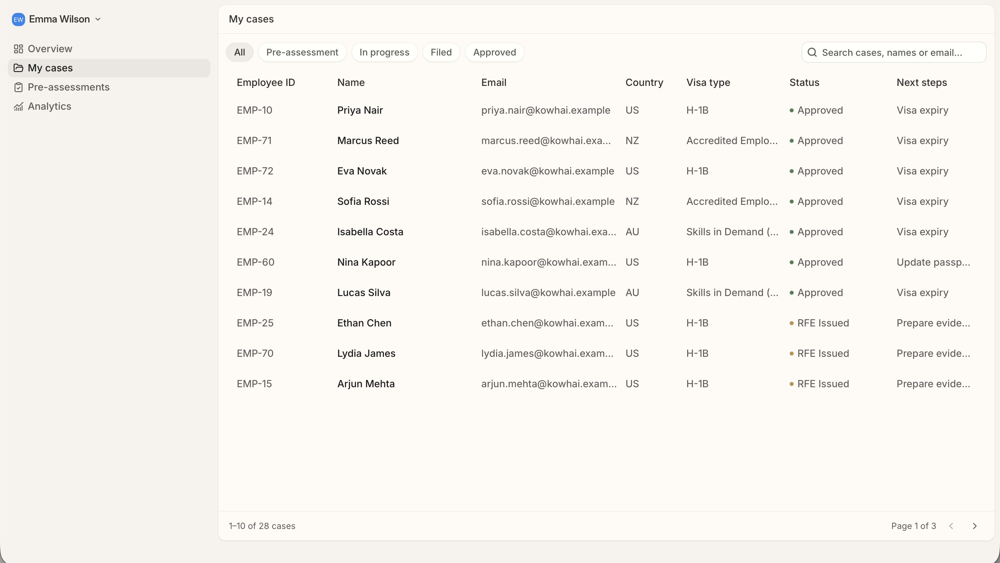
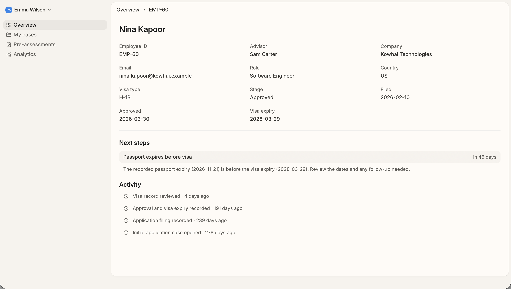

# Visa tracking app — v3

Earlier versions are available in the previous commits.

*This is a super basic read only visa tracking prototype (it's not fully polished)*

The app shows the HR view for **Emma Wilson at Kowhai Technologies**, with her company’s cases in Overview and My cases. All seeded people and records are fictional. Pre-assessments and Analytics are placeholders.

Advisor and employee/beneficiary views could use essentially the same setup, with some differences in content and actions. The backend scopes advisors to assigned cases and employees to their own cases.

Tracks employee visa cases, upcoming dates and work needing attention. Features include status totals, overdue/action groups, searchable case lists, status filters, pagination, case details and activity history.

Overdue means a recorded visa/passport expiry or an open task’s internal target has passed. Needs action includes other open tasks or review flags, such as missing profile details, an RFE, a passport expiring before the visa, or no update for over 30 days.

Built with React, TypeScript, Vite, TanStack Router/Query, Tailwind CSS and shadcn/ui. The Bun backend uses tRPC, Drizzle ORM and PostgreSQL.

## Structure

```text
src/routes/       Page routes and loaders
src/pages/        Page content
src/components/   Feature components and shared UI
src/api/          Typed API client
server/           API, database schema and seed data
tests/            Routing, data and seed checks
```

## Start

Requires Bun and Docker.

```bash
bun install
bun run setup-database
bun run dev:api
```

In another terminal, run `bun run dev` and open the URL it prints.

For later starts, keep the database running and start the API and UI in separate terminals.

## Screenshots

**Overview**



**My cases**



**Case details**


